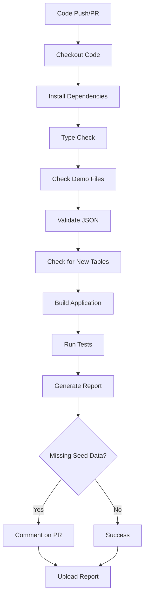

# GitHub Actions Workflows

This directory contains automated workflows for the Nuclear Supply Chain Management application.

## Workflows

### 1. Deploy Migrations (`deploy-migrations.yml`)

**Purpose**: Automatically deploys database migrations to Supabase when changes are pushed to the main branch.

**Triggers**:
- Push to `main` branch with changes in `migrations/**`
- Manual workflow dispatch

**What it does**:
- Detects changed migration files
- Links to Supabase project
- Applies migrations in order
- Verifies database schema
- Comments on commits with results

**Required Secrets**:
- `SUPABASE_ACCESS_TOKEN`
- `SUPABASE_DB_PASSWORD`
- `SUPABASE_PROJECT_ID`

---

### 2. Demo System Health Check (`demo-system-check.yml`)

**Purpose**: Validates the demo account system whenever new features are built or code changes are pushed.

**Triggers**:
- Push to `main` or `develop` branches (excluding documentation)
- Pull requests to `main` or `develop` (excluding documentation)
- Manual workflow dispatch

**What it does**:
1. **File Integrity Check**: Verifies all demo system files are present
2. **JSON Validation**: Ensures all seed data files are valid JSON
3. **Table Coverage Check**: Detects if new database tables need seed data
4. **Type Checking**: Runs TypeScript type validation
5. **Build Validation**: Ensures application builds successfully
6. **Test Execution**: Runs demo-specific tests (if available)
7. **Reporting**: Generates and uploads a health report
8. **PR Comments**: Automatically comments on PRs if action is needed

**Features**:
- ✅ Validates demo system integrity on every code change
- ✅ Detects missing seed data for new tables
- ✅ Provides actionable feedback via PR comments
- ✅ Generates detailed health reports
- ✅ Non-blocking for documentation changes
- ⚠️  Does NOT use AI-powered seed generation (manual seed creation required)

**Required Secrets** (optional):
- `NEXT_PUBLIC_SUPABASE_URL` (uses placeholder if not set)
- `NEXT_PUBLIC_SUPABASE_ANON_KEY` (uses placeholder if not set)

**Workflow Steps**:



**When Action is Required**:

If the workflow detects new database tables without seed data, it will:
1. Post a warning comment on the PR
2. List the tables that need seed data
3. Provide step-by-step instructions for adding seed data
4. Generate a detailed report with recommendations

**Adding Seed Data for New Tables**:

When the workflow alerts you about missing seed data:

1. Create a JSON file: `lib/demo/seeds/{table_name}.json`
   ```json
   [
     {
       "field1": "value1",
       "field2": "value2"
     }
   ]
   ```

2. Update `lib/demo/seeds/_metadata.json`:
   ```json
   {
     "coverage": {
       "table_name": {
         "table": "table_name",
         "recordCount": 5,
         "generatedBy": "manual",
         "generatedAt": "2026-01-16T12:00:00Z",
         "schemaHash": "..."
       }
     }
   }
   ```

3. Add to `DEMO_TABLES` in `lib/demo/config.ts`:
   ```typescript
   export const DEMO_TABLES = [
     'shipments',
     'activities',
     'compliance_alerts',
     'permits',
     'deliveries',
     'table_name', // Add new table here
   ] as const
   ```

4. Import and add to `SEED_DATA_REGISTRY` in `lib/demo/restore-demo-data.ts`:
   ```typescript
   import tableNameData from './seeds/table_name.json'
   
   const SEED_DATA_REGISTRY = {
     shipments: shipmentsData,
     activities: activitiesData,
     // ... other tables
     table_name: tableNameData, // Add new entry
   } as const
   ```

5. Commit and push your changes

---

## Manual Workflow Triggers

Both workflows can be triggered manually:

### Deploy Migrations
```bash
# Via GitHub UI:
# Actions → Deploy Database Migrations → Run workflow

# Optionally specify a migration file:
# migration_file: migrations/003_new_feature.sql
```

### Demo System Check
```bash
# Via GitHub UI:
# Actions → Demo System Health Check → Run workflow

# Options:
# run_full_check: true (for comprehensive validation)
```

---

## Viewing Results

### Workflow Status
- Go to **Actions** tab in GitHub repository
- Click on the workflow name
- View run history and details

### Demo System Reports
- Automatically generated on every run
- Available in **Artifacts** section of workflow run
- Retained for 30 days
- Contains:
  - Seed data coverage statistics
  - Missing tables list
  - File integrity status
  - Actionable recommendations

### PR Comments
- Automatically posted when issues are detected
- Provides step-by-step guidance
- Links to relevant documentation

---

## Troubleshooting

### Workflow Fails on Type Check
- Review TypeScript errors in workflow logs
- Run `npm run type-check` locally to debug
- Fix type errors before pushing

### Workflow Fails on Build
- Check Supabase environment variables
- Ensure all dependencies are installed
- Review build errors in logs

### Missing Seed Data Warnings
- Follow the instructions in the PR comment
- See `DEMO_ACCOUNT_IMPLEMENTATION.md` for detailed guide
- Ensure seed data matches table schema

### Workflow Not Triggering
- Check that changes are not in ignored paths (`**.md`, `docs/**`)
- Verify branch name matches trigger conditions
- Check workflow file syntax (YAML validation)

---

## Best Practices

1. **Always add seed data for new tables**: The demo system relies on seed data for all user-facing tables

2. **Test locally first**: Run type-check and build locally before pushing

3. **Keep seed data realistic**: Use authentic African healthcare context for demo data

4. **Update metadata**: Always update `_metadata.json` when adding new seed data

5. **Document changes**: Update relevant documentation when modifying workflows

6. **Manual seed creation**: The system does NOT use AI for seed generation - all seed data must be manually created

---

## Future Enhancements

Potential improvements for these workflows:

- [ ] Add performance benchmarks for demo system
- [ ] Automated seed data validation against schema
- [ ] Integration tests for demo account functionality
- [ ] Notification to Slack/email on critical failures
- [ ] Automated rollback on deployment failures
- [ ] Schema change detection and impact analysis

---

For more information, see:
- `DEMO_ACCOUNT_IMPLEMENTATION.md` - Demo system technical details
- `DEMO_QUICK_START.md` - Quick setup guide
- `README_DEMO_SYSTEM.md` - Complete demo system reference
