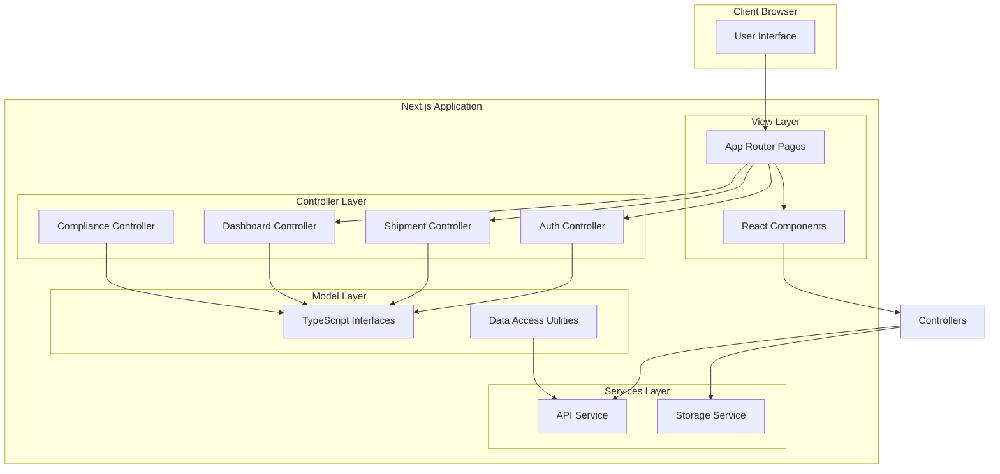

# Design Document: Next.js MVC Conversion

## Overview

This design document outlines the architecture and implementation approach for converting the NuClear React/Vite application to Next.js with an MVC (Model-View-Controller) design pattern. The conversion will leverage Next.js 14+ App Router, Bun runtime, and establish clear separation of concerns while preserving all existing functionality and visual design.

The MVC pattern will be adapted for the React/Next.js ecosystem:
- **Model**: TypeScript interfaces, data types, and data access utilities
- **View**: React components (pages and UI components) in the `app` and `components` directories
- **Controller**: Business logic functions handling data transformation, validation, and orchestration in a dedicated `controllers` directory

## Architecture



### Directory Structure

```
nuclear-nextjs/
├── app/                          # Next.js App Router (View Layer - Pages)
│   ├── layout.tsx                # Root layout
│   ├── page.tsx                  # Landing page (/)
│   ├── not-found.tsx             # 404 page
│   └── dashboard/
│       ├── layout.tsx            # Dashboard layout with sidebar
│       ├── page.tsx              # Dashboard home (/dashboard)
│       ├── procurement/
│       │   └── page.tsx          # Procurement module
│       ├── shipments/
│       │   └── page.tsx          # Shipments module
│       ├── compliance/
│       │   └── page.tsx          # Compliance module
│       ├── traceability/
│       │   └── page.tsx          # Traceability module
│       ├── reports/
│       │   └── page.tsx          # Reports module
│       └── settings/
│           └── page.tsx          # Settings module
├── components/                   # View Layer - Reusable Components
│   ├── landing/                  # Landing page components
│   │   ├── Hero.tsx
│   │   ├── Features.tsx
│   │   ├── Analytics.tsx
│   │   ├── ChainOfCustody.tsx
│   │   ├── QualityCompliance.tsx
│   │   ├── FinalCTA.tsx
│   │   └── Footer.tsx
│   ├── dashboard/                # Dashboard components
│   │   ├── DashboardLayout.tsx
│   │   ├── DashboardHome.tsx
│   │   ├── Sidebar.tsx
│   │   └── Header.tsx
│   ├── ui/                       # Base UI components (Radix-based)
│   │   ├── button.tsx
│   │   ├── card.tsx
│   │   ├── dialog.tsx
│   │   └── ... (all existing UI components)
│   └── shared/                   # Shared components
│       └── LoginModal.tsx
├── controllers/                  # Controller Layer
│   ├── auth.controller.ts        # Authentication logic
│   ├── shipment.controller.ts    # Shipment business logic
│   ├── dashboard.controller.ts   # Dashboard data aggregation
│   ├── compliance.controller.ts  # Compliance logic
│   └── index.ts                  # Controller exports
├── models/                       # Model Layer
│   ├── shipment.model.ts         # Shipment types and interfaces
│   ├── user.model.ts             # User types and interfaces
│   ├── activity.model.ts         # Activity types
│   ├── compliance.model.ts       # Compliance types
│   ├── dashboard.model.ts        # Dashboard statistics types
│   └── index.ts                  # Model exports
├── services/                     # Services Layer
│   ├── api.service.ts            # API communication
│   ├── storage.service.ts        # Local storage utilities
│   └── index.ts                  # Service exports
├── lib/                          # Utilities
│   └── utils.ts                  # Helper functions (cn, etc.)
├── styles/                       # Global styles
│   └── globals.css               # Tailwind and global CSS
├── public/                       # Static assets
├── next.config.js                # Next.js configuration
├── tailwind.config.ts            # Tailwind configuration
├── tsconfig.json                 # TypeScript configuration
└── package.json                  # Dependencies and scripts (Bun)
```

## Components and Interfaces

### Controller Interfaces

```typescript
// controllers/auth.controller.ts
interface AuthController {
  login(credentials: LoginCredentials): Promise<AuthResult>;
  logout(): void;
  getAuthState(): AuthState;
  isAuthenticated(): boolean;
}

// controllers/shipment.controller.ts
interface ShipmentController {
  getActiveShipments(): Shipment[];
  getShipmentById(id: string): Shipment | null;
  filterShipments(criteria: ShipmentFilter): Shipment[];
  sortShipments(shipments: Shipment[], sortBy: SortCriteria): Shipment[];
  getShipmentStats(): ShipmentStats;
}

// controllers/dashboard.controller.ts
interface DashboardController {
  getDashboardStats(): DashboardStats;
  getRecentActivity(): Activity[];
  getUpcomingDeliveries(): Delivery[];
  getComplianceAlerts(): ComplianceAlert[];
}

// controllers/compliance.controller.ts
interface ComplianceController {
  getComplianceStatus(): ComplianceStatus;
  getExpiringPermits(days: number): Permit[];
  getPendingDocuments(): Document[];
}
```

### View Component Props

```typescript
// Landing page components
interface HeroProps {
  onOpenLogin: () => void;
}

interface FinalCTAProps {
  onOpenLogin: () => void;
}

// Dashboard components
interface DashboardLayoutProps {
  children: React.ReactNode;
  currentPage: string;
}

interface SidebarProps {
  currentPage: string;
  onNavigate: (page: string) => void;
  collapsed: boolean;
  onToggleCollapse: () => void;
}

interface LoginModalProps {
  isOpen: boolean;
  onClose: () => void;
  onLogin: () => void;
}
```

### Server vs Client Component Strategy

| Component Type | Rendering | Reason |
|---------------|-----------|--------|
| Landing page sections (Hero, Features, etc.) | Server | Static content, SEO benefits |
| Dashboard Layout | Client | Requires useState for sidebar collapse |
| Dashboard modules | Client | Interactive data display, state management |
| UI primitives (Button, Card, etc.) | Client | Event handlers, Radix UI requires client |
| Login Modal | Client | Form state, dialog interactions |
| Navigation | Client | Active state tracking, click handlers |

## Data Models

### Shipment Model

```typescript
// models/shipment.model.ts
export interface Shipment {
  id: string;
  isotope: string;
  origin: string;
  destination: string;
  status: ShipmentStatus;
  eta: string;
  statusColor: string;
}

export type ShipmentStatus = 
  | 'In Transit' 
  | 'At Customs' 
  | 'Dispatched' 
  | 'Delivered' 
  | 'Pending';

export interface ShipmentFilter {
  status?: ShipmentStatus;
  isotope?: string;
  origin?: string;
  destination?: string;
}

export interface ShipmentStats {
  activeCount: number;
  onSchedulePercentage: number;
  pendingCount: number;
  urgentCount: number;
}
```

### User Model

```typescript
// models/user.model.ts
export interface User {
  id: string;
  name: string;
  role: UserRole;
  initials: string;
}

export type UserRole = 
  | 'Hospital Administrator' 
  | 'Logistics Manager' 
  | 'Compliance Officer';

export interface AuthState {
  isAuthenticated: boolean;
  user: User | null;
}

export interface LoginCredentials {
  email: string;
  password: string;
}

export interface AuthResult {
  success: boolean;
  user?: User;
  error?: string;
}
```

### Activity Model

```typescript
// models/activity.model.ts
export interface Activity {
  id: string;
  time: string;
  event: string;
  type: ActivityType;
}

export type ActivityType = 
  | 'delivery' 
  | 'procurement' 
  | 'customs' 
  | 'alert' 
  | 'approval';
```

### Dashboard Model

```typescript
// models/dashboard.model.ts
export interface DashboardStats {
  activeShipments: StatCard;
  pendingRequests: StatCard;
  complianceStatus: StatCard;
  monthlyTotal: StatCard;
}

export interface StatCard {
  label: string;
  value: string;
  subtext: string;
  color: string;
  textColor: string;
}

export interface Delivery {
  date: string;
  time: string;
  isotope: string;
  destination: string;
}
```

### Compliance Model

```typescript
// models/compliance.model.ts
export interface ComplianceAlert {
  id: string;
  severity: 'warning' | 'info' | 'error';
  title: string;
  description: string;
}

export interface Permit {
  id: string;
  name: string;
  expiryDate: Date;
  status: 'valid' | 'expiring' | 'expired';
}

export interface ComplianceStatus {
  overallStatus: 'clear' | 'warning' | 'critical';
  alerts: ComplianceAlert[];
  expiringPermits: Permit[];
}
```

### Navigation Model

```typescript
// models/navigation.model.ts
export interface NavigationItem {
  id: string;
  label: string;
  icon: React.ComponentType<{ className?: string }>;
  href: string;
}

export type DashboardPage = 
  | 'dashboard' 
  | 'procurement' 
  | 'shipments' 
  | 'compliance' 
  | 'traceability' 
  | 'reports' 
  | 'settings';
```


## Correctness Properties

*A property is a characteristic or behavior that should hold true across all valid executions of a system—essentially, a formal statement about what the system should do. Properties serve as the bridge between human-readable specifications and machine-verifiable correctness guarantees.*

### Property 1: Dependency Preservation

*For any* dependency in the original package.json that is compatible with Next.js, the migrated package.json SHALL contain that dependency with a compatible version.

**Validates: Requirements 1.2**

### Property 2: Route-Component Mapping

*For any* defined dashboard route (procurement, shipments, compliance, traceability, reports, settings), navigating to that route SHALL render the corresponding module component.

**Validates: Requirements 3.3**

### Property 3: Invalid Route Handling

*For any* URL path that is not defined in the application routes, the router SHALL display the 404 not-found page.

**Validates: Requirements 3.4**

### Property 4: Client-Side Navigation

*For any* navigation between dashboard modules, the navigation SHALL occur without a full page reload (client-side routing).

**Validates: Requirements 3.5**

### Property 5: Controller Data Transformation

*For any* valid raw data input to a controller function, the controller SHALL return correctly transformed and typed output data matching the expected model interface.

**Validates: Requirements 5.1, 5.4**

### Property 6: Auth State Management

*For any* authentication action (login, logout), the auth controller SHALL correctly update the authentication state to reflect the action taken.

**Validates: Requirements 5.2**

### Property 7: Data Filtering Correctness

*For any* filter criteria applied to a dataset, the filtered results SHALL contain only items that match all specified filter conditions.

**Validates: Requirements 5.3**

### Property 8: Validation Error Handling

*For any* invalid input data passed to a controller validation function, the controller SHALL return an error result with appropriate error information rather than throwing an exception.

**Validates: Requirements 5.6**

### Property 9: Auth-View Mapping

*For any* authentication state, the application SHALL display the landing page when unauthenticated and the dashboard when authenticated.

**Validates: Requirements 8.1, 8.4**

### Property 10: Login Redirect

*For any* successful login action, the application SHALL redirect the user to the dashboard page.

**Validates: Requirements 8.3**

### Property 11: Auth Persistence

*For any* page navigation within an authenticated session, the authentication state SHALL persist and remain valid.

**Validates: Requirements 8.5**

### Property 12: UI Component Equivalence

*For any* UI component with any valid props combination, the rendered output SHALL be functionally equivalent to the original Vite/React implementation.

**Validates: Requirements 9.2, 9.4**

## Error Handling

### Controller Error Handling

Controllers will implement a consistent error handling pattern:

```typescript
// types/result.ts
export type Result<T, E = Error> = 
  | { success: true; data: T }
  | { success: false; error: E };

// Example usage in controller
export function validateShipment(data: unknown): Result<Shipment, ValidationError> {
  if (!isValidShipment(data)) {
    return { 
      success: false, 
      error: { 
        code: 'INVALID_SHIPMENT', 
        message: 'Shipment data is invalid',
        fields: getInvalidFields(data)
      }
    };
  }
  return { success: true, data: data as Shipment };
}
```

### View Error Handling

- Use Next.js error boundaries via `error.tsx` files in route segments
- Display user-friendly error messages
- Log errors for debugging

### API Error Handling

- Services return Result types for predictable error handling
- Network errors are caught and transformed into application errors
- Timeout handling for long-running requests

## Testing Strategy

### Testing Framework

- **Unit Tests**: Vitest for fast unit testing
- **Property-Based Tests**: fast-check library for property-based testing
- **Component Tests**: React Testing Library for component testing
- **E2E Tests**: Playwright for end-to-end testing (optional)

### Test Organization

```
__tests__/
├── unit/
│   ├── controllers/
│   │   ├── auth.controller.test.ts
│   │   ├── shipment.controller.test.ts
│   │   └── dashboard.controller.test.ts
│   └── models/
│       └── validation.test.ts
├── properties/
│   ├── routing.property.test.ts
│   ├── controller.property.test.ts
│   ├── auth.property.test.ts
│   └── ui.property.test.ts
└── components/
    ├── landing/
    └── dashboard/
```

### Property-Based Testing Configuration

Each property test will:
- Run minimum 100 iterations
- Use fast-check for input generation
- Reference the design document property being tested

Example property test structure:

```typescript
import { fc } from 'fast-check';
import { describe, it, expect } from 'vitest';

describe('Controller Data Transformation', () => {
  // Feature: nextjs-mvc-conversion, Property 5: Controller Data Transformation
  it('should correctly transform any valid raw shipment data', () => {
    fc.assert(
      fc.property(
        fc.record({
          id: fc.string({ minLength: 1 }),
          isotope: fc.string({ minLength: 1 }),
          origin: fc.string({ minLength: 1 }),
          destination: fc.string({ minLength: 1 }),
          status: fc.constantFrom('In Transit', 'At Customs', 'Dispatched', 'Delivered', 'Pending'),
          eta: fc.string()
        }),
        (rawData) => {
          const result = transformShipmentData(rawData);
          expect(result.success).toBe(true);
          if (result.success) {
            expect(result.data).toMatchObject({
              id: rawData.id,
              isotope: rawData.isotope,
              origin: rawData.origin,
              destination: rawData.destination,
              status: rawData.status
            });
          }
        }
      ),
      { numRuns: 100 }
    );
  });
});
```

### Unit Testing Balance

Unit tests will focus on:
- Specific examples demonstrating correct behavior
- Edge cases (empty inputs, boundary values)
- Error conditions and validation failures
- Integration points between components

Property tests will focus on:
- Universal properties that hold for all valid inputs
- Data transformation correctness
- State management consistency
- Routing behavior
